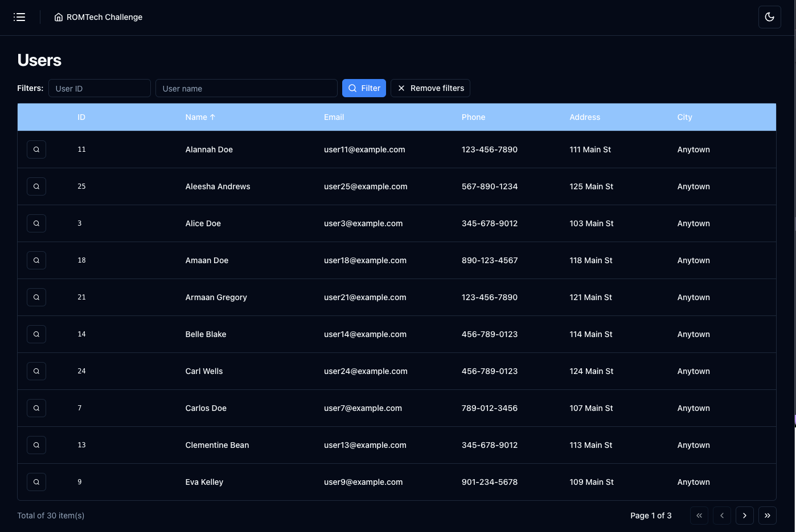

## ROMTech Challenge

This project implements a nice small app that shows a scrolling list with a few columns of data, where the user can select a row in the list and open a detailed screen to edit the details.

**Getting Started**

1. **Clone the repository:**
   ```bash
   git clone https://github.com/hugomarcelosilva/romtech-challenge.git
   ```

2. **Install dependencies:**
  * Make sure you have pnpm installed. If not, please refer to their installation instructions: https://pnpm.io/installation
  * Once pnpm is ready, run the following command:
   ```bash
   pnpm install 
   # Or, if you prefer npm:
   npm install
   ```

**Running the Development Server**

```bash
pnpm dev
# Or
npm run dev
```
This will start a development server, usually on http://localhost:5173/

**Running Tests**

```bash
pnpm test
# Or
npm test
```

**Code Linting**

```bash
pnpm lint
# Or 
npm run lint
```

**Project Structure**

* `src`
   * `api`: Contains the API functions.
   * `components`: Contains the React components for the game.
   * `lib`: Holds utility functions.
   * `pages`: Holds the layout, users, 404 and error pages. 

**License**

This project is licensed under the MIT License. See the [LICENSE](LICENSE) for details.